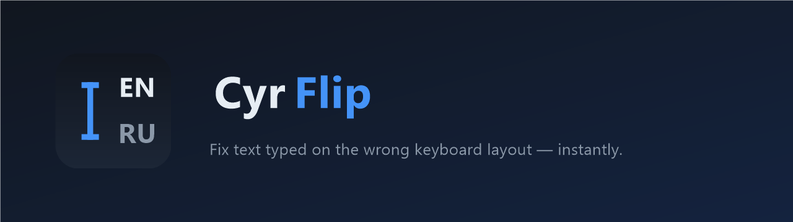
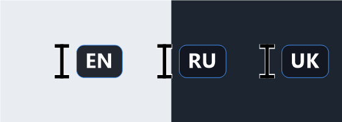

# CyrFlip

CyrFlip — крошечная утилита для Windows (живёт в трее) с двумя задачами:

1. **Индикатор раскладки там, где вы печатаете (главная функция).** Маленький маркер **EN / RU / UK** показывается и на текстовом курсоре мыши (I-beam), **и рядом с мигающей кареткой** — чтобы вы всегда видели, в какой раскладке набираете. Обновляется в реальном времени. (Указатель мыши во время набора часто остаётся стрелкой — поэтому маркер у каретки особенно важен.)
2. **Транслитерация одной клавишей.** Текст, набранный в неправильной раскладке, можно «перевернуть» на месте между QWERTY и ЙЦУКЕН (EN ↔ RU, UK в планах) горячей клавишей.



## Статус

Ранняя разработка. Полная спецификация —
[PLAN/KeyboardTransliterator_Specification_v1.0.md](PLAN/KeyboardTransliterator_Specification_v1.0.md),
архитектура и соглашения — [CLAUDE.md](CLAUDE.md).

## Как это работает

1. CyrFlip отслеживает активную раскладку и заменяет системный **текстовый курсор** на каретку с маркером раскладки (EN/RU/UK). Тот же маркер показывается и на значке в трее.
2. Глобальный низкоуровневый хук клавиатуры слушает горячую клавишу (по умолчанию **Ctrl+Shift+F12**); по срабатыванию выделение копируется, транслитерируется и вставляется обратно.

> Изменение курсора системное (`SetSystemCursor`) и восстанавливается при выходе CyrFlip. Меняется только текстовый I-beam, а не обычная стрелка-указатель.

## Использование

- **Запуск** — запустите `CyrFlip.exe`. Окна нет; программа сидит в области уведомлений (системном трее). Значок показывает активную раскладку (**EN/RU/UK**).
- **Исправление текста** — выделите текст в неправильной раскладке, нажмите **Ctrl+Shift+F12** — и он заменится на месте. Работает в любом приложении (Блокнот, Word, браузеры, …).
- **Меню в трее** (правый клик по значку):
  - **Flip EN ⇄ RU: Ctrl+Shift+F12** — показывает текущую горячую клавишу.
  - **Start with Windows** — запуск CyrFlip при входе в систему (для текущего пользователя, без прав администратора).
  - **Exit** — выход.

CyrFlip — обычное настольное приложение, а не служба Windows: глобальный хук клавиатуры и индикатор раскладки должны работать в интерактивном сеансе пользователя, поэтому «автозапуск» — это запись в автозагрузке пользователя, а не служба.

## Расширение для VS Code

Внутри VS Code внешний маркер не может точно следовать за кареткой (Monaco рисует собственную каретку).
Дополнительное расширение в [vscode-extension/](vscode-extension/) читает раскладку, публикуемую CyrFlip,
и рисует маркер **точно у каретки редактора**. CyrFlip должен быть запущен; о сборке/упаковке см. README расширения.

## Требования

- Windows 10 / 11 (x64)
- .NET Framework 4.8 (предустановлен в Windows 10/11 — ничего доустанавливать не нужно)

## Сборка и запуск

```powershell
dotnet build CyrFlip.sln -c Release
.\src\CyrFlip\bin\Release\net48\CyrFlip.exe
```

Запуск тестов:

```powershell
dotnet test CyrFlip.sln
```

## Конфигурация

Необязательный `config.json` (рядом с exe или в `%APPDATA%\CyrFlip\`):

```json
{ "hotkey": "Ctrl+Shift+F12", "cursorSize": 24 }
```

## Известные ограничения

- **Маркер у каретки виден не во всех приложениях.** CyrFlip определяет позицию каретки через системную каретку Windows или UI Automation. Некоторые приложения не предоставляют ни того, ни другого — прежде всего **окна консоли/терминала** (Командная строка, PowerShell, Windows Terminal) и отдельные приложения с собственной отрисовкой текста и слабой поддержкой UI Automation. Там маркер у каретки скрыт; значок в трее и маркер на курсоре мыши продолжают показывать раскладку. А в некоторых редакторах (например, VS Code и другие на основе Monaco) UI Automation сообщает позицию каретки неточно, поэтому маркер может появляться у края поля ввода, а не строго у каретки. Для VS Code используйте [дополнительное расширение](vscode-extension/) — оно ставит маркер точно у каретки редактора.
- **Текстовый курсор мыши (I-beam) может остаться изменённым после принудительного завершения.** CyrFlip заменяет системный I-beam глобально и восстанавливает его при выходе. Если процесс завершён жёстко (например, «Снять задачу» в Диспетчере задач), Windows не восстановит курсор до следующего запуска CyrFlip или повторного входа в систему.
- **Транслитерация только EN ↔ RU.** Индикатор раскладки поддерживает EN/RU/UK, но «переворот» по горячей клавише пока преобразует между QWERTY и ЙЦУКЕН; украинские специфические буквы пока не транслитерируются.

## Связанный проект

- [Universal Agent Kit](https://serzhyale.github.io/universal-agent-kit/) — сопутствующий набор инструментов от того же автора.

## Автор

**SerZhyAle** — [sza.od.ua](https://sza.od.ua) · [sza@ukr.net](mailto:sza@ukr.net)

## Лицензия

MIT — см. [LICENSE](LICENSE).
