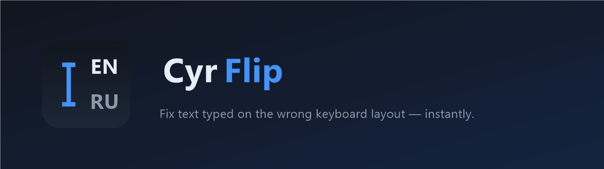
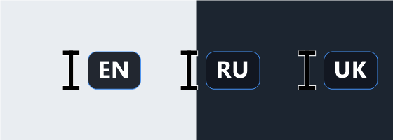

# CyrFlip

CyrFlip - крошечная утилита для Windows (живёт в трее) с несколькими скромными задачами:

1. **Индикатор раскладки там, где вы печатаете (главная функция).** Маркер показывает код текущей раскладки рядом с мигающей кареткой, на текстовом курсоре мыши (I-beam) и на значке в трее. Встроенный набор охватывает EN, ZH, HI, ES, FR, AR, BN, PT, RU, UR, DE, IT и UK, а любая другая установленная в Windows раскладка тоже получает свой двухбуквенный код.
2. **Таблица конвертаций раскладок.** Кроме привычного EN ⇄ RU можно добавить сколько угодно строк «из раскладки ⇄ в раскладку», у каждой своя глобальная комбинация. Преобразование идёт **по физическим клавишам** (поэтому AZERTY и QWERTZ обрабатываются верно), работает **в обе стороны** - если активна вторая раскладка пары, та же комбинация конвертирует обратно, - а затем включается нужная раскладка.
3. **Исправление CapsLock.** Вторая горячая клавиша (**Ctrl+Shift+F11**) меняет регистр выделенного текста и при желании приводит саму клавишу CapsLock в соответствие с исправленным текстом.
4. **Окно настроек, заменяющее раздел «Язык и регион» Windows.** Установка, порядок и удаление раскладок, сочетание для перебора языков и прямые сочетания на каждый язык, которые обрабатывает **сама Windows** (они работают, даже когда CyrFlip закрыт). Ничего не скачивается - раскладки уже входят в состав Windows.
5. **Необязательный модуль быстрого запуска (поглощённый [OneClickRunner](https://github.com/SerZhyAle/OneClickRunner)).** Ваши программы, скрипты и загрузки yt-dlp как сценарии: запуск из трея, из таблицы настроек, по необязательной глобальной комбинации на сценарий и из **Jump List** панели задач. По умолчанию выключен - пока не включите, CyrFlip ведёт себя ровно как раньше.
6. **Необязательный переводчик, работающий на вашем же компьютере.** Выделите текст в любом месте Windows, нажмите комбинацию - и перевод появится в маленьком окне у курсора мыши, дописываясь по мере того, как его пишет модель. Работает на [Ollama](https://ollama.com) - бесплатной программе, которую вы один раз ставите сами: ни аккаунта, ни ключа, ни единой строчки текста, уходящей разработчику или в облачный сервис. По умолчанию выключен.
7. **Необязательное собственное контекстное меню.** Удерживайте **Ctrl** и щёлкните правой кнопкой по выделению: «Копировать/Вырезать/Вставить», ваши конвертации раскладок, исправление регистра, строки перевода, «Быстрый запуск» и история буфера - всё у указателя. Меню не забирает фокус, поэтому выделение его переживает. По умолчанию выключено, и пока выключено, мышиный хук вообще не устанавливается.
8. **Необязательные быстрые заметки.** Нажали **Ctrl+Shift+Alt+N**, набрали или вставили, закрыли. Текст хранится ровно таким, каким его дали, - без Markdown, подсветки и автоформатирования, - поэтому фрагмент кода вставляется обратно в редактор без единой правки, а поиск смотрит внутрь текста, потому что имя большинство заметок так и не получает. Хранятся только на вашем компьютере и шифруются Windows DPAPI. По умолчанию выключено.
9. **Дополнения по мелочи:** необязательная зашифрованная история буфера обмена с поиском, два переключателя «не давать засыпать» и интерфейс на **13 языках**.



## Статус

Ранняя разработка - то есть «работает, но мы оставляем за собой право на скромность». Архитектура и
соглашения - [CLAUDE.md](CLAUDE.md).

## Как это работает

1. CyrFlip отслеживает активную раскладку и показывает её двухбуквенный код в трёх местах: рядом с мигающей **кареткой**, на системном **I-beam** курсоре мыши (необязательно) и на **значке в трее**. Рядом с кареткой и у курсора мыши маркер **полупрозрачный**, так что текст под ним остаётся читаемым, а буквы вписаны в значок с границей ровно в один пиксель. При включённом CapsLock все три получают тонкую цветную рамку.
   **Буквы называют язык** - US и Dvorak одинаково читаются как `EN`, - а **цвет называет раскладку**: у каждой из 25 раскладок 13 курируемых языков свой оттенок цвета её языка, поэтому русский всегда красный, но «Русская машинопись» - другой красный. Именно это показывает компактный режим **точки**, где цвет и есть весь маркер. Любая другая раскладка сохраняет буквы своего языка (`PL`, `JA`, `TR`) и получает один нейтральный цвет. [Полная таблица - в руководстве.](https://serzhyale.github.io/CyrFlip/ru/guide.html#layout-colours)
2. Глобальный низкоуровневый хук клавиатуры слушает горячие клавиши; по срабатыванию выделение копируется, преобразуется и вставляется обратно. Постоянных комбинации две - **исправление регистра** (**Ctrl+Shift+F11**) и **менеджер буфера** (**Ctrl+Shift+F10**); всё остальное задаётся строками таблицы конвертаций, которая начинается с пары **EN ⇄ RU на Ctrl+Shift+F12**.
3. **История буфера** включается по желанию. Это узкое окно поверх других с Unicode-текстами: запись выбирается мышкой, её можно закрепить или удалить, по всей истории есть поиск; показать/скрыть окно можно через **Ctrl+Shift+F10**. Локальный журнал зашифрован Windows DPAPI, а захват можно поставить на паузу или полностью очистить.

> Изменение курсора системное (`SetSystemCursor`) и восстанавливается при выходе CyrFlip. Меняется только текстовый I-beam, а не обычная стрелка-указатель.

## Использование

- **Запуск** - запустите `CyrFlip.exe`. Программа тихо сидит в области уведомлений (системном трее), её значок показывает активную раскладку.
- **Исправление текста** - выделите тот самый `ghbdtn`, который задумывался как «привет», нажмите **Ctrl+Shift+F12** - и он заменится на месте. Работает в любом приложении (Блокнот, Word, браузеры, ..). Эта комбинация - просто первая строка таблицы конвертаций (EN ⇄ RU); рядом можно добавить сколько угодно других пар со своими комбинациями.
- **Исправление CapsLock** - выделите `pRIVET`, который задумывался как `Privet`, и нажмите **Ctrl+Shift+F11**.
- **Другие языки** - в «Настройки → Языки Windows» нажмите «Добавить популярные языки», затем на вкладке «Конвертация раскладок» создайте нужные пары и их комбинации.
- **Сохранить фрагмент** - нажмите **Ctrl+Shift+Alt+N**, вставьте код или запишите мысль, закройте окно. Заметка сохранится и без имени, а найдётся потом по любой части своего текста.
- **Меню в трее** (правый клик по значку) держит частые переключатели: показать/скрыть историю, включение истории буфера и пауза захвата, три переключателя индикаторов, два переключателя «не давать засыпать», подменю **Быстрый запуск**, пункты **Перевести буфер обмена** и **Быстрые заметки** (каждый виден, только пока его модуль включён), **Настройки...** и **Выход**. Двойной клик по значку открывает настройки.
- **Настройки** (десять вкладок, все изменения применяются сразу, без перезапуска):
  - **Общие** - запуск вместе с Windows, «не давать компьютеру засыпать» и «не блокировать экран» (оба запоминаются между запусками), язык интерфейса (13 на выбор) и **тема** - как в Windows (по умолчанию), светлая или тёмная. Все окна, диалоги и меню переключаются сразу, а в режиме «как в Windows» CyrFlip следует за Windows, пока работает.
  - **Индикаторы** - маркер на курсоре мыши (по умолчанию выключен), маркер у каретки (включён), компактная точка вместо букв, «менять раскладку после конвертации текста» и «синхронизировать CapsLock после исправления регистра».
  - **Горячие клавиши** - общий выключатель плюс отдельные выключатель и комбинация для исправления регистра и менеджера буфера, уступка комбинаций клиенту удалённого рабочего стола, а также выключатель **контекстного меню** и аккорд мыши, который его открывает.
  - **Конвертация раскладок** - одна таблица, где живут **все** комбинации, конвертирующие текст между раскладками, включая EN ⇄ RU. Каждая строка - пара установленных раскладок со своей комбинацией и своим выключателем, и каждая работает в обе стороны.
  - **Языки Windows** - установка, порядок и удаление раскладок Windows, выбор сочетания для перебора (Alt+Shift, Ctrl+Shift, `` ` `` или выключено) и прямые сочетания на язык, которые обрабатывает сама Windows. Оба раздела один раз сохраняют состояние «как было до CyrFlip» и умеют его вернуть.
  - **Быстрый запуск** - лаунчер сценариев (см. ниже).
  - **Быстрые заметки** - локальный блокнот (см. ниже): выключатель, его комбинация, перенос длинных строк в редакторе, экспорт всех заметок в один Markdown-файл и кнопка, которая уничтожает их все.
  - **Перевод** - локальный переводчик (см. ниже): адрес и модель Ollama, кнопки установки, запуска и проверки связи, таблица направлений перевода и что делать с результатом.
  - **Буфер обмена** и **О программе** - параметры истории, её прозрачность и поиск, **версия сборки** (тот же штамп `YY.M.D.HHmm`, что и у релизного ZIP, - сразу видно, вошло ли исправление в вашу копию), диагностика положения каретки и **Отправить логи автору..** (см. ниже).

CyrFlip - обычное настольное приложение, а не служба Windows: глобальный хук клавиатуры и индикатор раскладки должны работать в интерактивном сеансе пользователя, поэтому «автозапуск» - это запись в автозагрузке пользователя, а не служба.

## Быстрый запуск (лаунчер сценариев)

Необязательный модуль, вобравший в себя [OneClickRunner](https://github.com/SerZhyAle/OneClickRunner), - один процесс в трее вместо двух. **По умолчанию выключен**; включается в «Настройки → Быстрый запуск».

- **Сценарии** двух типов: *программа/скрипт* (путь, аргументы, рабочая папка, необязательный запуск от администратора) и *yt-dlp* (папка загрузки + доп. параметры; ссылка запрашивается при каждом запуске, а внешняя утилита `yt-dlp` должна быть в `PATH`). В таблице настроек их можно добавлять, менять, клонировать, сортировать, искать, экспортировать и импортировать.
- **Четыре способа запуска:** подменю **Быстрый запуск** в трее, таблица настроек (двойной клик / Enter), необязательная **глобальная комбинация на сценарий** и **Jump List** панели задач - правый клик по значку CyrFlip на панели задач (закрепите его, и список будет под рукой, даже когда CyrFlip не запущен: клик по задаче тогда выполняет разовый запуск без старта трея).
- **Хранение:** по одному XML на сценарий в `%APPDATA%\CyrFlip\Scenarios`, формат совместим с OneClickRunner. Выключение модуля очищает трей и Jump List, но файлы остаются.
- **Перенос:** при первом включении CyrFlip предложит скопировать существующие сценарии OneClickRunner (`%APPDATA%\OneClickRunner\Scenarios`); исходные файлы никогда не изменяются, а кнопка «Импорт из OneClickRunner...» повторяет перенос в любой момент. `.ps1` запускаются через PowerShell с разовым `-ExecutionPolicy Bypass`, `.bat`/`.cmd` - через `cmd.exe`; права администратора запрашиваются только у сценариев с соответствующей отметкой.
- **Файлы сценариев:** перенос сохраняет порядок OneClickRunner и идентификатор каждого сценария; файл, который не читается, пропускается и называется по имени, но ничего не ломает. Повторный перенос добавляет вторую копию каждого сценария под новым идентификатором - переносите один раз или удалите дубли. Комбинация клавиш сценария - собственное поле CyrFlip: OneClickRunner её не видит и теряет, если сам пересохранит этот файл. Экспортированный сценарий - обычный XML-файл, в котором путь и аргументы записаны как есть, поэтому никогда не храните пароль в аргументах.

### Языки интерфейса

Интерфейс доступен на **English, Русский, Українська, Deutsch, Italiano, Español, Français, Português, العربية, हिन्दी, বাংলা, اردو и 中文**. При первом запуске выбирается язык интерфейса Windows, иначе English. Для арабского и урду интерфейс зеркалится справа налево. Переводы на языки, которыми автор не владеет, сделаны моделью и не вычитаны - поправки принимаются через issue или pull request.

## Перевод (локальный Ollama)

Необязательный модуль: переводит выделенный текст языковой моделью, работающей **на вашем же компьютере**. **По умолчанию выключен**; включается в «Настройки → Перевод». Пока он выключен, ни одна комбинация не занята, пункта в трее нет, и CyrFlip не открывает ни одного сетевого соединения.

- **Как это выглядит:** выделите текст в любом месте Windows, нажмите комбинацию (строка, создаваемая при первом включении, использует **Ctrl+Shift+F9** - F12 занят переворотом раскладки, F11 регистром, F10 менеджером буфера), и у курсора мыши появится маленькое окно, которое заполняется по мере того, как пишет модель.
- **[Ollama](https://ollama.com) устанавливается отдельно** - это бесплатная программа, которую вы один раз ставите на свой компьютер. CyrFlip её не включает в себя, не заводит ни аккаунта, ни ключа, и не отправляет текст ни разработчику, ни в какой-либо облачный сервис. Адрес по умолчанию - `http://localhost:11434`, то есть ваш же компьютер; на вкладке настроек прямо сказано, что указание другого адреса означает отправку выделенного текста на ту машину.
- **Направления - открытая таблица**, как и конвертации раскладок: каждая строка - «переводить на этот язык» плюс своя глобальная комбинация. Кроме 13 языков интерфейса строка может целиться в **язык интерфейса** или в **язык раскладки, активной в целевом окне**; и то и другое определяется в момент нажатия.
- **Результат** можно положить в буфер обмена - тогда необязательная история буфера запишет его, как любую другую копию, - или сразу вставить вместо выделения. Оба варианта по умолчанию выключены.
- **Кнопки-помощники** на вкладке настроек: установить Ollama, запустить его, проверить связь и загрузить модель. Рекомендуемые - `aya-expanse:8b` (~4,7 ГБ, по умолчанию - лучший перевод из проверенных) и `gemma2:9b` (~5 ГБ). Модели меньше 4 ГБ проверку на русском и украинском не прошли, поэтому `gemma2:2b` (~1,5 ГБ) остаётся только для машин, где мало места, и будет ошибаться. Память под модель держит процесс **Ollama**, а не CyrFlip, который остаётся в своём бюджете < 50 МБ. В сборке из Microsoft Store кнопка установки только открывает ollama.com - приложению из Store нельзя скачивать и запускать установщик.
- **О чём стоит знать честно:** качество - это качество локальной модели; первый перевод после холодного старта идёт долго, потому что модель нужно загрузить; Ollama и модель - многогигабайтная загрузка, которую вы делаете один раз; а из длинного выделения переводятся первые 4000 символов, о чём окно сообщает.

## Быстрые заметки

Маленький локальный блокнот для того, что хочется сохранить прямо сейчас и найти потом. **По умолчанию выключено**; включается в «Настройки → Быстрые заметки». Пока выключено, CyrFlip не читает и не создаёт файл заметок, в трее нет пункта заметок и комбинация не назначена.

- **Один жест:** **Ctrl+Shift+Alt+N** открывает окно с новой заметкой, курсор уже в поле текста. Список можно открыть и из трея, а выделение - сохранить прямо из собственного контекстного меню CyrFlip.
- **Текст остаётся текстом.** Никакого Markdown-рендера, подсветки синтаксиса, «умных» кавычек и замены табов: смысл в том, чтобы фрагмент кода вставился обратно туда, откуда взят, без единой правки. Редактор моноширинный и по умолчанию **не** переносит длинные строки - это настройка.
- **Имя необязательно.** Большинство заметок его так и не получают; в списке вместо имени показывается первая непустая строка, и этот заголовок вычисляется по пути на экран, а не сохраняется, - поэтому изменение первой строки потом ничего не портит.
- **Поиск и есть указатель.** Он смотрит сразу в имя, в текст и в каждый пункт списка, начиная с первого введённого символа, и результаты сохраняют обычный порядок, а не невидимый рейтинг релевантности.
- **Сначала новые, по дате создания.** Правка старой заметки не двигает её с места: дата создания назначается один раз и больше не меняется, а дата изменения - метаданные.
- **Списки** - второй вид заметки: один уровень отмечаемых пунктов, которые можно добавлять, переименовывать, менять местами и удалять. Заметку можно перевести из одного вида в другой, и CyrFlip предупредит заранее, если при этом потеряются отметки или точные переводы строк.
- **Хранится локально и в зашифрованном виде.** Журнал только на дозапись в той же папке, что и остальные данные CyrFlip, каждая запись защищена Windows DPAPI для вашей учётной записи - включая имя, а не только текст. Ничего не уходит в сеть, ничего не индексируется поиском Windows, и история буфера сама по себе в заметки не превращается. Это **не** хранилище секретов: не храните там пароли, боевые токены и приватные ключи.
- **Как достать текст:** копировать, экспортировать одну заметку в `.txt` или `.md`, выгрузить все заметки в один Markdown-файл или **Копировать для Google Keep** - текст уходит в буфер обмена, а CyrFlip предлагает открыть Keep, где вы его вставляете. Это честный предел: Keep API у Google - интерфейс для администратора Workspace, а не то, чем может пользоваться личный аккаунт, поэтому CyrFlip не изображает синхронизацию.

## Расширение для VS Code

Внутри VS Code внешний маркер не может точно следовать за кареткой (Monaco рисует собственную каретку).
Дополнительное расширение в [vscode-extension/](vscode-extension/) читает раскладку, публикуемую CyrFlip,
и рисует маркер **точно у каретки редактора**. CyrFlip должен быть запущен; о сборке/упаковке см. README расширения.

## Требования

- Windows 10 / 11 (x64)
- .NET Framework 4.8 (предустановлен в Windows 10/11 - ничего доустанавливать не нужно)

## Сборка и запуск

```powershell
dotnet build CyrFlip.sln -c Release
.\src\CyrFlip\bin\Release\net48\CyrFlip.exe
```

Запуск тестов:

```powershell
dotnet test CyrFlip.sln
```

## Конфигурация

Все настройки хранятся в реестре Windows (`HKCU\Software\CyrFlip`) и меняются через окно настроек - файл править не нужно.

| Параметр | По умолчанию | Что делает |
| --- | --- | --- |
| Таблица конвертаций | одна строка EN ⇄ RU на `Ctrl+Shift+F12` | Все комбинации, конвертирующие текст между раскладками. Первая строка создаётся при первом запуске, её можно изменить или удалить, как любую другую; пар можно завести сколько угодно |
| Комбинация регистра | `Ctrl+Shift+F11` | Меняет регистр выделения - исправление «забыл выключить CapsLock» |
| Комбинация буфера | `Ctrl+Shift+F10` | Показывает или скрывает окно менеджера буфера |
| Выключатели хоткеев | вкл. | Общий выключатель плюс отдельные переключатели (регистр / буфер) на вкладке «Горячие клавиши»; у каждой строки конвертации свой выключатель |
| Уступать хоткеи RDP | выкл. | Пока в фокусе клиент удалённого рабочего стола (mstsc/msrdc), комбинация уходит в удалённый сеанс, где её обработает тамошний CyrFlip |
| Индикатор на курсоре | выкл. | Заменяет системный I-beam курсором с меткой раскладки |
| Метка у каретки | вкл. | Показывает маркер раскладки рядом с мигающей кареткой |
| Точка вместо букв | выкл. | Цветная точка вместо букв раскладки в метке у каретки |
| Менять раскладку после конвертации | выкл. | После конвертации переключает активное окно на ту раскладку, в которой текст теперь набран, чтобы сразу продолжить печатать |
| Синхронизировать CapsLock | выкл. | После исправления регистра приводит саму клавишу CapsLock в соответствие с текстом - выключает, если он заканчивается маленькой буквой, включает, если большой |
| Язык интерфейса | язык ОС | 13 языков; если перевода для языка Windows нет, используется English |
| Тема | как в Windows | Светлая, тёмная или вслед за светлой/тёмной темой самой Windows - на лету, без перезапуска. Ей следуют все окна, диалоги и меню CyrFlip; контрастная тема Windows всегда важнее. Метка раскладки от темы не зависит (её цвет обозначает раскладку), а всплывающие уведомления и диалоги выбора файла рисует сама Windows |
| Не давать засыпать / не гасить экран | выкл. | Не дают Windows уснуть и погасить экран по простою. Оба запоминаются: оставите включённым - компьютер не уснёт и после перезапуска, следить за вашей батареей CyrFlip не станет |
| История буфера | выкл. | Зашифрованная локальная история текста; включается из трея или настроек |
| Показывать окно менеджера | вкл. | Запоминает, открыто ли окно: закрыли - при следующем запуске останется закрытым, история всё равно ведётся в фоне |
| Быстрый запуск | выкл. | Лаунчер сценариев: подменю в трее, комбинации на сценарий и задачи Jump List панели задач. Сценарии лежат в `%APPDATA%\CyrFlip\Scenarios` (по одному XML) и переживают выключение |
| Перевод | выкл. | Локальный переводчик. Хранит таблицу направлений со своими комбинациями (первая строка получает `Ctrl+Shift+F9`), адрес Ollama (по умолчанию `http://localhost:11434`) и модель (`aya-expanse:8b`), а также класть ли результат в буфер и вставлять ли его вместо выделения (оба выключены). Строка может целить в любой язык, который знает Windows; что из этого потянет модель - вопрос к модели, и редактор даёт ссылку на её описание. Сам Ollama устанавливается отдельно |
| Контекстное меню | выкл. | Собственное меню CyrFlip над выделением, открывается аккордом мыши (по умолчанию `Ctrl+RightClick`; правой кнопке всегда нужен модификатор, иначе CyrFlip съел бы все контекстные меню Windows). Пока выключено, мышиный хук не устанавливается |
| Быстрые заметки | выкл. | Локальный блокнот: его комбинация (`Ctrl+Shift+Alt+N`), перенос длинных строк в редакторе (выключен), размер и положение окна. Сами заметки лежат в `quick-notes.log` рядом с остальными данными CyrFlip, по одной DPAPI-зашифрованной записи на операцию; пока функция выключена, файл не создаётся, и в «Отправить логи автору» он не попадает никогда |

Вкладка «Языки Windows» пишет настройки **самой Windows**, а не CyrFlip: список установленных раскладок (`HKCU\Keyboard Layout\Preload` и современное хранилище профиля пользователя), сочетание перебора и прямые сочетания на язык (`HKCU\Control Panel\Input Method\Hot Keys`). Каждый из двух разделов один раз снимает снимок состояния «до CyrFlip» и умеет его вернуть.

Устаревший `config.json` (рядом с exe или в `%APPDATA%\CyrFlip\`) при первом запуске автоматически переносится в реестр.

## Известные ограничения

- **Маркер у каретки виден не во всех приложениях.** CyrFlip определяет позицию каретки через системную каретку Windows или UI Automation. Некоторые приложения держат свою каретку в строгой тайне и не предоставляют ни того, ни другого - прежде всего **окна консоли/терминала** (Командная строка, PowerShell, Windows Terminal) и отдельные приложения с собственной отрисовкой текста и слабой поддержкой UI Automation. Там маркер у каретки вежливо уходит со сцены; значок в трее и маркер на курсоре мыши продолжают показывать раскладку. А в некоторых редакторах (например, VS Code и другие на основе Monaco) UI Automation сообщает позицию каретки неточно, поэтому маркер может появляться у края поля ввода, а не строго у каретки. Для VS Code используйте [дополнительное расширение](vscode-extension/) - оно ставит маркер точно у каретки редактора.
- **Текстовый курсор мыши (I-beam) может остаться изменённым после принудительного завершения.** CyrFlip заменяет системный I-beam глобально и вежливо восстанавливает его при выходе. Если процесс завершён жёстко (например, «Снять задачу» в Диспетчере задач), попрощаться он не успевает, поэтому Windows оставляет себе нарядный курсор до следующего запуска CyrFlip или повторного входа в систему.
- **IME и составной ввод.** Профили надёжно преобразуют символы, которые Windows сопоставляет одной физической клавише. Уже введённые иероглифы китайского Pinyin и составные/«мёртвые» клавиши неоднозначны, поэтому CyrFlip бережно оставляет такие символы как есть, но после успешной операции всё равно переключает целевую раскладку.
- **Две раскладки одного языка неразличимы в индикаторе.** Показывается язык, а не вариант: US и Dvorak обе читаются как `EN`, стандартная русская и «машинопись» - как `RU`. Точный KLID каждой установленной раскладки виден на вкладке «Языки Windows» - именно к нему привязываются профили конвертации.
- **Часть изменений в «Языках Windows» требует перезахода.** Установка, порядок и удаление раскладок, а также прямые сочетания применяются к текущему сеансу сразу, но иногда Windows окончательно принимает их только после выхода и повторного входа. Версия из Microsoft Store вдобавок работает в контейнере, поэтому Windows может перенаправить эти записи в реестр внутрь пакета - вкладка предупреждает об этом и даёт ссылку на настройки Windows.

## Как сообщить о проблеме

**Настройки → О программе → Отправить логи автору..** собирает собственные логи CyrFlip
(`launcher.log`, `context-menu.log`, `translate.log`, диагностику каретки, `layout.txt`) и отчёт о
конфигурации в один ZIP в подпапке `reports` рядом с файлом раскладки и открывает письмо на
[sza@ukr.net](mailto:sza@ukr.net) с этим вложением.

- **Отправляете вы.** Своего соединения CyrFlip не открывает: транспорт - ваша почтовая программа, а
  кнопка «Отправить» - ваша. Без нажатия кнопки не происходит ничего.
- **Истории буфера обмена в архиве нет никогда.** До того как появится письмо, вы видите список
  файлов, их размеры и путь к архиву и можете открыть папку и прочитать его - это и есть шаг
  согласия, а не набор флажков. В логах встречаются пути к файлам, а значит и имя вашей учётной
  записи Windows.
- **Если почтовый клиент не принимает вложение из ссылки** - веб-почта и новый Outlook не принимают,
  потому что в `mailto:` поля для вложения нет вообще - CyrFlip всё равно откроет письмо и выделит
  архив в проводнике, чтобы его можно было перетащить. Классический Outlook и Thunderbird
  прикладывают файл сразу.
- Архив в любом случае остаётся у вас на диске: хранятся пять последних, более старые удаляются.

Issue на [GitHub](https://github.com/SerZhyAle/CyrFlip/issues) работает не хуже - приложите к нему тот
же архив, если по описанию проблема не очевидна.

## Предупреждения Windows или антивируса

Windows SmartScreen («Система Windows защитила ваш компьютер») или антивирус могут остановить `CyrFlip.exe` из ZIP. Полный ответ - что это за предупреждение, почему оно появляется, что именно нажать и чего CyrFlip никогда не делает - на странице **[Почему Windows или антивирус предупреждают](https://serzhyale.github.io/CyrFlip/ru/trust.html)**. Коротко:

- **Файл не подписан, и это осознанный выбор.** Сертификат для подписи кода стоит денег каждый год, а CyrFlip бесплатный и сделан одним разработчиком, поэтому ZIP с GitHub не подписан. **winget ставит тот же неподписанный ZIP.** Подписана (Microsoft) только версия из **Microsoft Store** - она не встречает SmartScreen. Репутация в SmartScreen растёт с числом загрузок, и предупреждение для сборки со временем исчезает.
- **Поведенческая эвристика - вторая причина, и подпись её не лечит.** Некоторые антивирусы - прежде всего **Avast / AVG**, как `IDP.Generic` (Behavior Shield) - реагируют на то, что индикатор раскладки делает именно то, за чем они следят: глобальный хук клавиатуры, синтез нажатий, доступ к буферу обмена, замена системного курсора. Исходный код открыт - посмотрите, что он делает, в [src/CyrFlip/](src/CyrFlip/).
- **Распакуйте ZIP в постоянную папку**, например `%LOCALAPPDATA%\Programs\CyrFlip\`, и запускайте оттуда - не из архива и не из `%TEMP%`: временная папка сама по себе снижает репутацию.
- **Сообщите о ложном срабатывании**, чтобы производитель снял метку: [форма Avast](https://www.avast.com/false-positive-file-form.php) · [форма AVG](https://www.avg.com/en-ww/report-false-positive). Сверьте SHA-256 с файлом `.sha256`, опубликованным рядом с каждым релизом.
## Связанный проект

- [Universal Agent Kit](https://serzhyale.github.io/universal-agent-kit/) - сопутствующий набор инструментов от того же автора.

## Автор

**SerZhyAle** - [sza.od.ua](https://sza.od.ua) · [sza@ukr.net](mailto:sza@ukr.net)

## Лицензия

MIT - см. [LICENSE](LICENSE).
